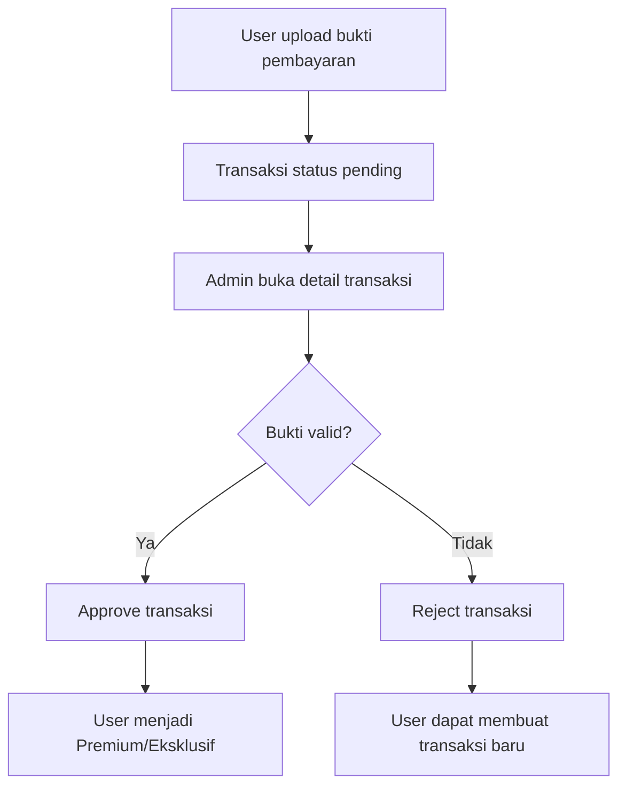
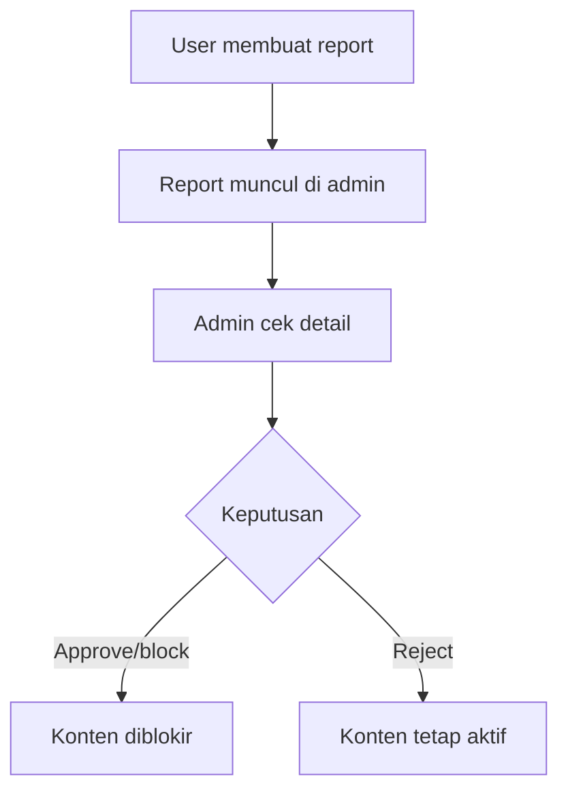
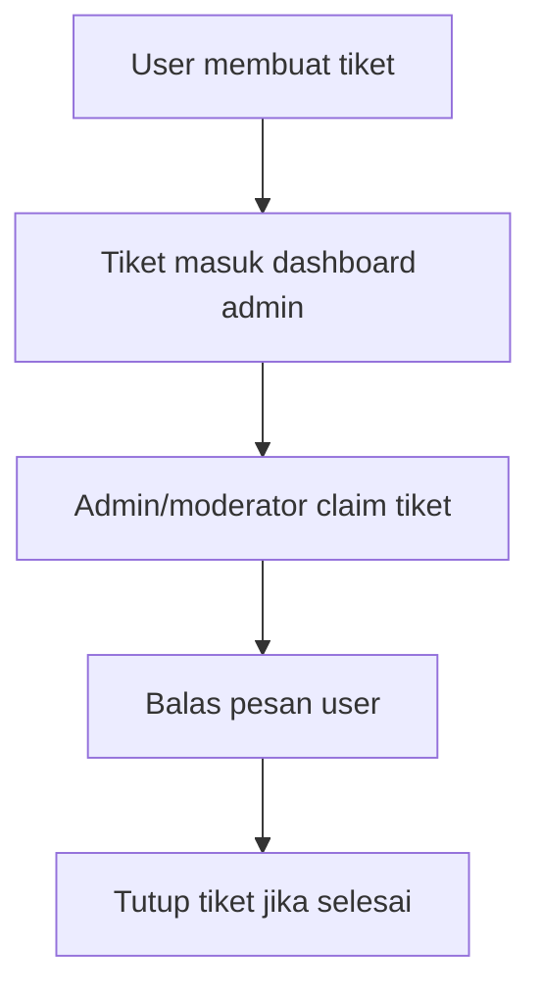

# Admin Guide FLIX

Panduan ini menjelaskan workflow admin dan moderator di dashboard FLIX.

## Akses Admin

Admin login melalui halaman login biasa dengan akun role `admin`.

Hak akses:

| Role | Akses |
| --- | --- |
| admin | Dashboard penuh, user, film, review, community, transaksi, report, customer service, settings |
| moderator | Film, review, community, transaksi, report, customer service |

## Dashboard

Dashboard admin menampilkan:

- Statistik user, konten, transaksi, dan aktivitas.
- Chart aktivitas.
- Aktivitas terbaru.
- Film yang sering masuk watchlist.

Gunakan dashboard untuk melihat kondisi umum aplikasi sebelum masuk ke menu detail.

## Kelola Film

Admin/moderator dapat:

1. Melihat daftar film manual.
2. Menambah film manual.
3. Mengedit data film manual.

Endpoint terkait:

- `GET /api/admin/movies`
- `POST /api/admin/movies`
- `PUT /api/admin/movies/:id`

## Kelola User

Hanya admin yang dapat mengelola user.

Admin dapat:

1. Melihat list user.
2. Membuka detail user.
3. Mengubah data user.
4. Reset password user.
5. Menonaktifkan/mengaktifkan user.
6. Menghapus user non-admin jika data test perlu dibersihkan.

Endpoint terkait:

- `GET /api/admin/users`
- `GET /api/admin/users/:id`
- `PUT /api/admin/users/:id`
- `POST /api/admin/users/:id/reset-password`
- `DELETE /api/admin/users/:id`
- `PATCH /api/admin/users/:id/status`

Catatan:

- User nonaktif tidak bisa login sampai diaktifkan kembali.
- Delete user hanya untuk user non-admin dan tidak bisa dipakai admin untuk menghapus akun sendiri.
- Reset password harus diberikan ke user secara aman.

## Transaksi Premium/Eksklusif

Workflow transaksi:

Admin dapat:

1. Buka menu Transaksi.
2. Filter transaksi berdasarkan status/metode/paket.
3. Buka detail transaksi.
4. Cek bukti pembayaran.
5. Klik setujui atau tolak.

Efek approve:

- `payment_transactions.status` menjadi `approved`.
- `users.is_premium` menjadi `true`.
- `users.subscription_plan` menjadi `premium` atau `exclusive`.
- Masa aktif dihitung dari `duration_months`.

Endpoint terkait:

- `GET /api/admin/transactions`
- `PATCH /api/admin/transactions/:id/status`

## Payment Settings

Admin/moderator dapat mengatur:

- Metode pembayaran QRIS, Bank, E-Wallet.
- Nomor rekening/kode pembayaran.
- Nama pemilik rekening.
- Logo/QR metode pembayaran.
- Harga Premium dan Eksklusif.

Endpoint terkait:

- `GET /api/admin/payment-settings`
- `PUT /api/admin/payment-settings`

Catatan penting:

- Logo/QR pembayaran disimpan sebagai data URL di database.
- Paket `premium_yearly` pada UI digunakan sebagai paket Eksklusif.
- Harga Eksklusif diperlakukan sebagai harga bulanan Eksklusif.
- Durasi pembayaran tersedia 1, 3, 6, dan 12 bulan.

## Moderasi Review

Admin/moderator dapat:

1. Melihat review.
2. Melihat laporan review.
3. Blokir review jika laporan valid.
4. Tolak laporan jika tidak valid.
5. Mengembalikan review yang diblokir.

Endpoint terkait:

- `GET /api/admin/reviews`
- `PATCH /api/admin/reviews/reports/:reportId/status`

## Moderasi Community

Admin/moderator dapat memoderasi:

- Post.
- Comment.
- Reply.
- User yang dilaporkan.

Workflow:

Endpoint terkait:

- `GET /api/admin/community`
- `PATCH /api/admin/community/reports/:reportId/status`

## Contact Us

Pesan dari form Contact Us masuk ke menu Report/Contact.

Admin/moderator dapat:

1. Membaca pesan user.
2. Mengubah status pesan.
3. Menandai sebagai selesai.

Endpoint terkait:

- `GET /api/admin/contact-us`
- `PATCH /api/admin/contact-us/:id/status`

## Customer Service

Workflow:

Admin/moderator dapat:

- Melihat list tiket.
- Membuka detail tiket.
- Claim tiket.
- Membalas pesan.
- Mengirim lampiran.
- Menutup tiket.

Endpoint terkait:

- `GET /api/admin/customer-service/tickets`
- `GET /api/admin/customer-service/tickets/:id`
- `PATCH /api/admin/customer-service/tickets/:id/claim`
- `POST /api/admin/customer-service/tickets/:id/messages`
- `PATCH /api/admin/customer-service/tickets/:id/close`

## Settings Admin

Admin dapat mengubah:

- Profile admin.
- Foto profile admin.
- Password admin.

Gunakan password yang kuat dan jangan membagikan akun admin.

## Checklist Demo Admin

1. Login sebagai admin.
2. Buka dashboard dan tunjukkan statistik.
3. Buka transaksi pending, lalu approve/reject.
4. Buka payment settings dan tunjukkan metode pembayaran.
5. Buka moderasi review/community.
6. Buka Contact Us atau Customer Service.
7. Buka Kelola User dan tunjukkan detail user.
