# User Flow FLIX

Dokumen ini merangkum alur utama pengguna, subscription, admin, moderator, dan customer service di website FLIX.

## 1. Pengunjung Baru

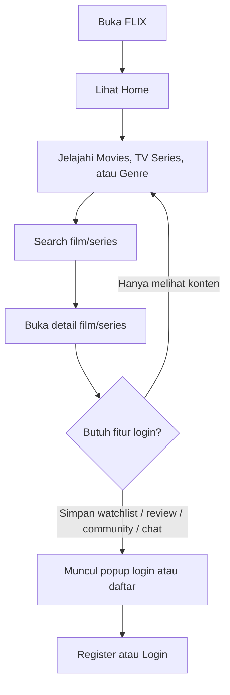

## 2. Register, Verifikasi, dan Login

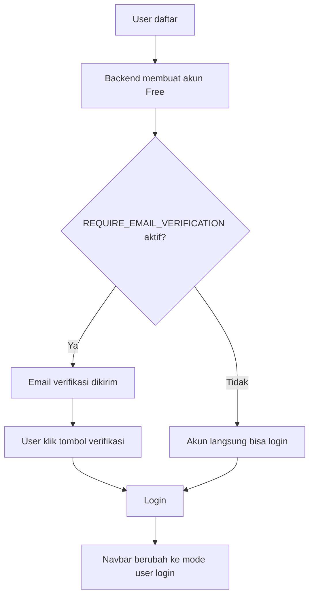

Catatan production saat ini: `REQUIRE_EMAIL_VERIFICATION=false`, sehingga register tidak menunggu email verifikasi.

## 3. Film, TV Series, dan Watchlist

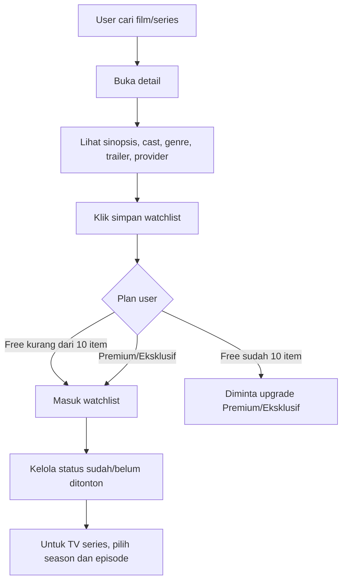

Catatan teknis: watchlist backend tersedia di `flix.user_watchlist`, sedangkan beberapa progress tontonan seperti episode/status watched masih disimpan di browser storage.

## 4. Review Film dan TV Series

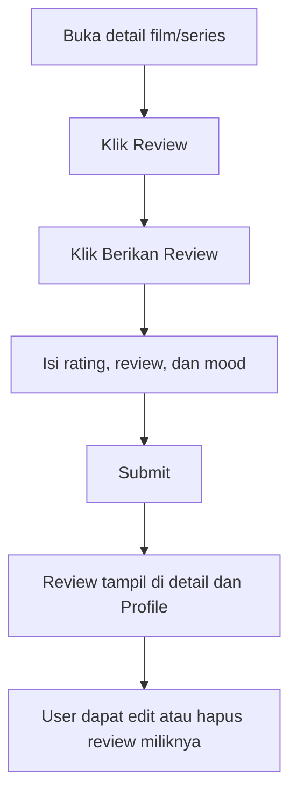

## 5. Community

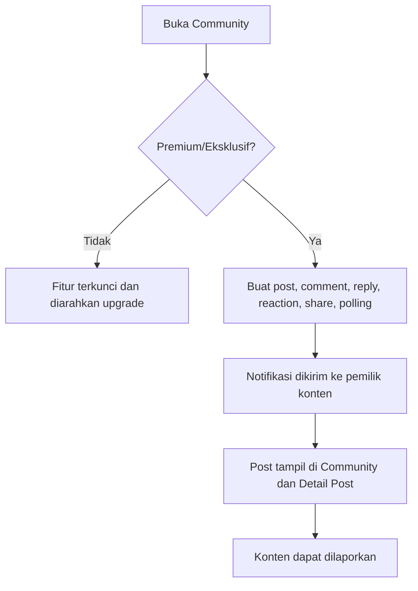

## 6. Friendlist dan Chat

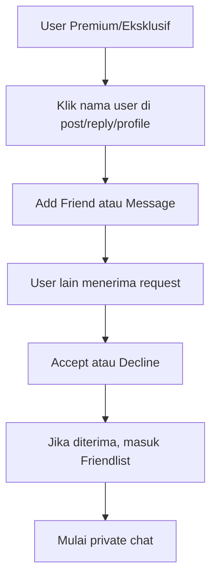

## 7. Upgrade Premium/Eksklusif

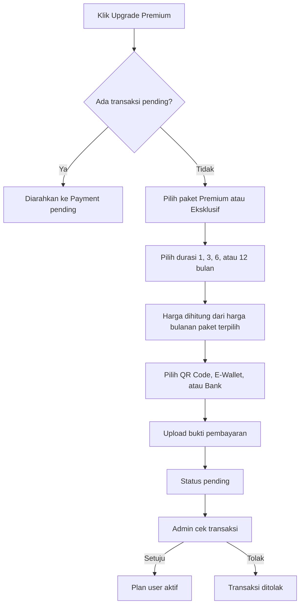

Catatan paket: Eksklusif memakai kode `premium_yearly` di API/database, tetapi UI memperlakukannya sebagai harga bulanan Eksklusif. Durasi 12 bulan berarti 12 kali harga bulanan Eksklusif.

Catatan upload: bukti pembayaran disimpan sebagai data URL di database agar tetap tersedia di deployment Vercel yang stateless.

## 8. Chatbot FLIX

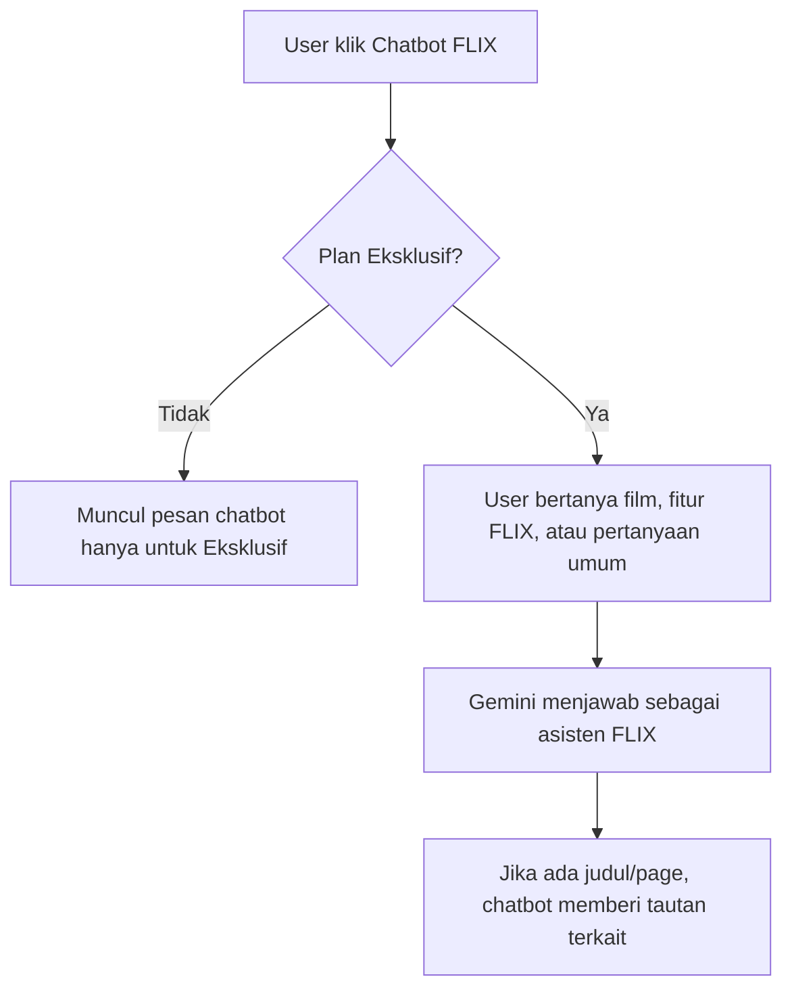

## 9. Contact Us dan Customer Service

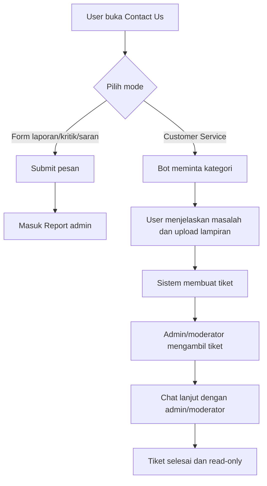

Lampiran customer service mengikuti mekanisme upload backend dan tidak mengandalkan folder runtime permanen untuk production.

## 10. Admin dan Moderator

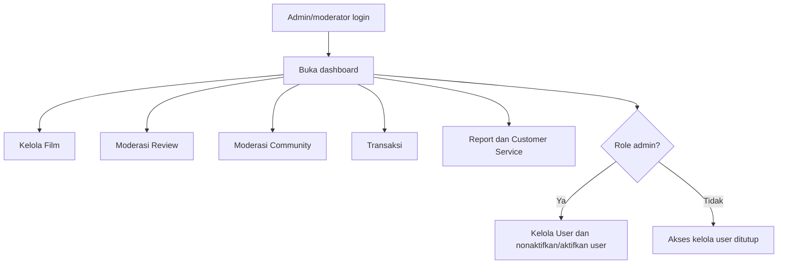

## 11. Moderasi Report

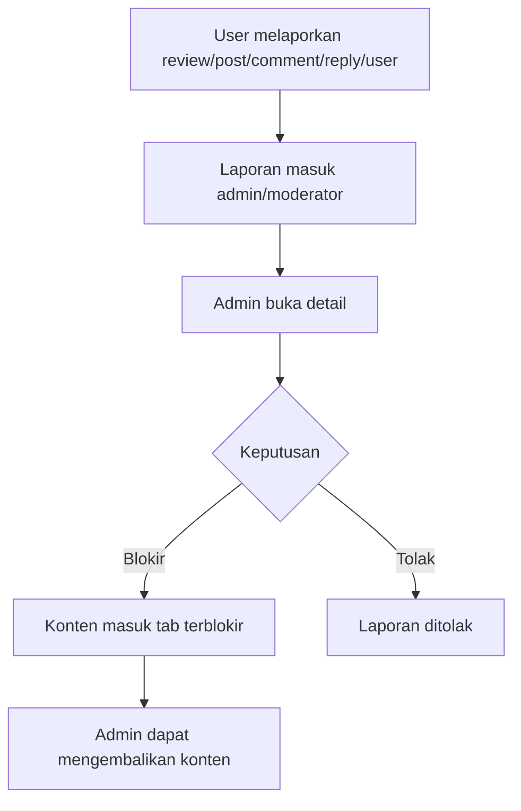

## Ringkasan Hak Akses

| Plan | Fokus Akses |
| --- | --- |
| Free | Lihat/search film dan series, review, watchlist maksimal 10 |
| Premium | Semua fitur Free, community, chat, friendlist, watchlist unlimited, badge premium |
| Eksklusif | Semua fitur Premium ditambah Chatbot FLIX dan badge Eksklusif |

| Role | Fokus Akses |
| --- | --- |
| registered_user | Akses berdasarkan plan |
| moderator | Kelola film, review, community, transaksi, dan report |
| admin | Semua akses termasuk kelola user |
